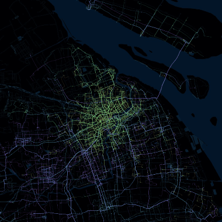
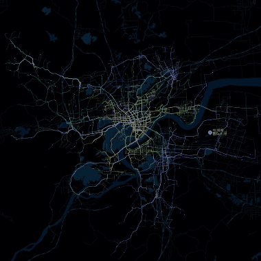
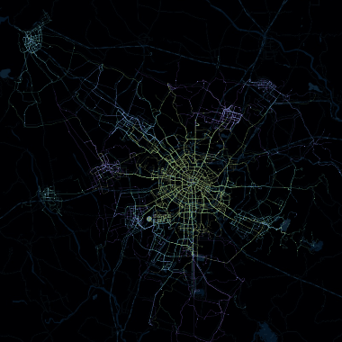
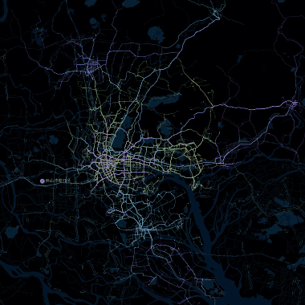
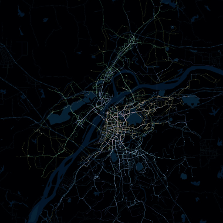
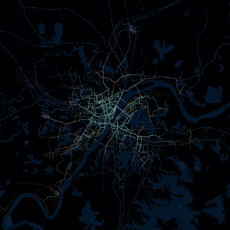
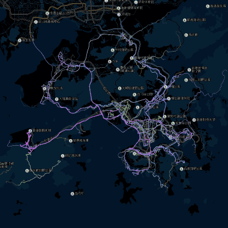
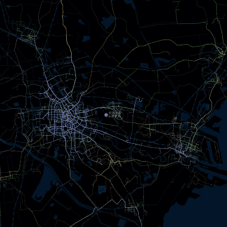
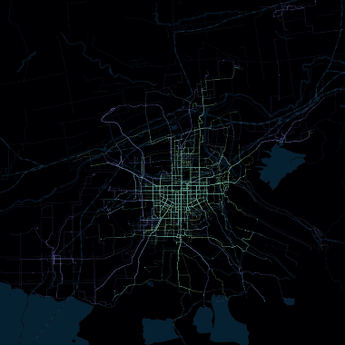
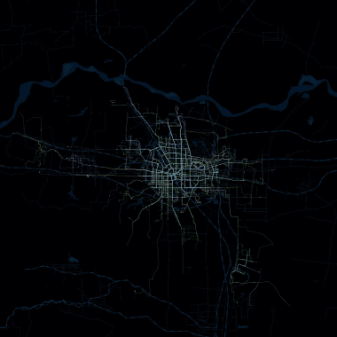

## City Vein

城市脉络，以数据还原模样，探寻城市肌理

### Related
[Echarts Demo](https://gallery.echartsjs.com/editor.html?c=bmap-bus)

### Page

[GitHub Page](https://96486d9b.github.io/city-vein)

### Run

```
zh_en: 'hangzhou' zh_cn: '杭州'
python script/main.py
```

### Example

[GitHub Page](https://96486d9b.github.io/city-vein) 澳门 长春 长沙 重庆 大连 贵阳 哈尔滨 海口 合肥 呼和浩特 济南 开封 昆明 兰州 拉萨 洛阳 南昌 南宁 青岛 沈阳 石家庄 苏州 太原 台州 乌鲁木齐 厦门 西宁 银川

TODO 台北

[GIF](https://github.com/96486d9b/city-vein/tree/master/gif) 北京 上海 杭州 成都 广州 深圳 南京 武汉 香港 天津 西安 郑州

 

 

 

 

 

 
