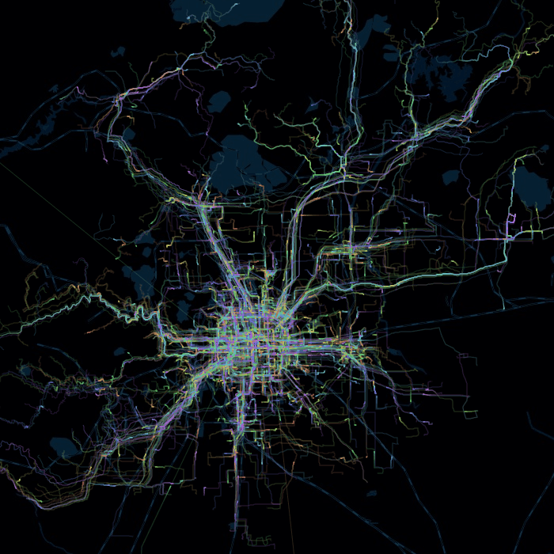

## City-Vein

> 想通过公交线路，地铁线路来刻画一个城市的模样。
>
> 通过数据描绘出城市的拓扑结构，于是有了这个项目，城市脉络。

### Procedure

1. 8684公交网

```
1.1 通过8684提供的各个城市的公交网，爬取所有的公交信息。包括公交线路，以及每一条线路内的所有站点信息。
```

2. 高德地图api

```
2.1 首先划定城市范围，确定城市位置，获得城市基本信息。
2.2 根据地图api区域编码，可以初步获得每一个站点的经纬度信息，这里需要对经纬度进行转码。这里的经纬度获取是站点独立的。
2.3 初步得到的经纬度是不准确的，考虑通过地图上显示的公交线路，直接获得线路上所有站点的经纬度。这里的经纬度获取是站点相关的，这里高德没有开放API接口。
2.4 通过2.2和2.3的经纬度矫正，得到所有节点的最终经纬度。
2.5 根据经纬度，将路线矢量化，表示成一个基向量和若干偏移向量的表达形式。
2.6 通过2.5可以绘制初步的结构图，但公交路线并非和实际道路重合，显得杂乱无章。
2.7 考虑抓取道路信息进行匹配，或者调用路线规划api（公交部分），将我们矢量化后的线路匹配到道路上。
2.8 高德地图的查询接口，是有一定的反爬虫机制的，需要不断迭代IP。
```

3. 百度echarts(北京为例)

 

4. 链接

> [北京](https://www.96486d9b.xyz/City-Vein/beijing.html)

> [杭州](https://www.96486d9b.xyz/City-Vein/hangzhou.html)
### Dependency

``` 
1. 高德api
2. 百度api
3. requests, requests, urllib, hashlib
4. 百度echarts
5. *
```

### Catalog

> lib: 百度echats依赖js文件

> data: 整理的各类线路数据

> script: 爬虫脚本

> *.html: 可视化文件

### TODO

还在进行中~