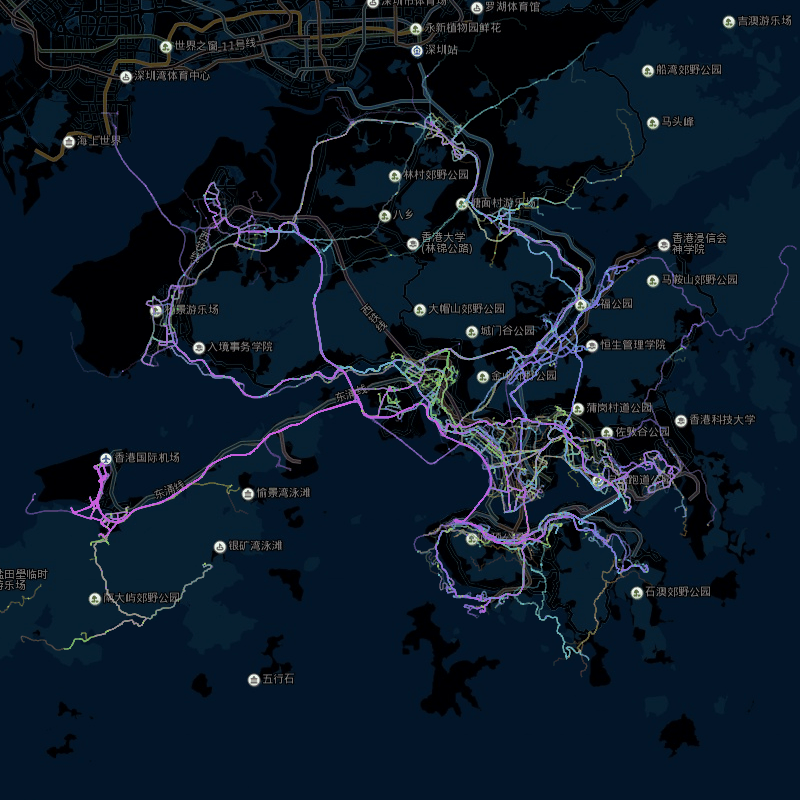
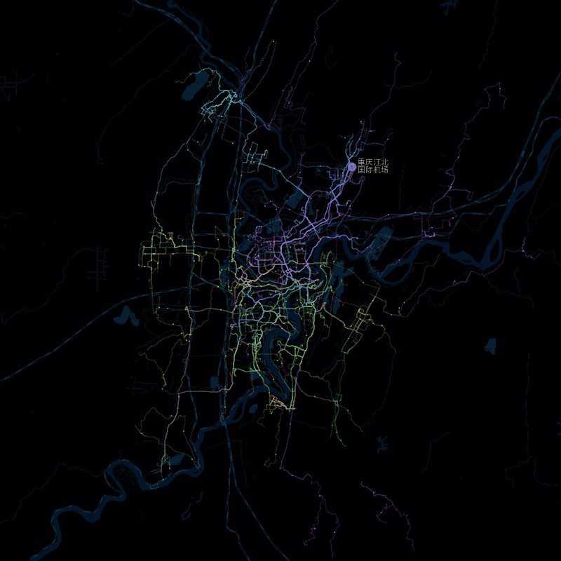

## Leaf Vein

城市脉络，以数据还原模样，探寻城市肌理

### Demos

[北京](https://96486d9b.github.io/leaf-vein/html/beijing.html)

[杭州](https://96486d9b.github.io/leaf-vein/html/hangzhou.html) 

[上海](https://96486d9b.github.io/leaf-vein/html/shanghai.html)

[香港](https://96486d9b.github.io/leaf-vein/html/hongkong.html)

[广州](https://96486d9b.github.io/leaf-vein/html/guangzhou.html)

[西安](https://96486d9b.github.io/leaf-vein/html/xian.html)

[成都](https://96486d9b.github.io/leaf-vein/html/chengdu.html)

[重庆](https://96486d9b.github.io/leaf-vein/html/chongqing.html)

[南京](https://96486d9b.github.io/leaf-vein/html/nanjing.html)

[郑州](https://96486d9b.github.io/leaf-vein/html/zhengzhou.html)
[开封](https://96486d9b.github.io/leaf-vein/html/kaifeng.html)
[天津](https://96486d9b.github.io/leaf-vein/html/tianjin.html)
[银川](https://96486d9b.github.io/leaf-vein/html/yinchuan.html)
[长沙](https://96486d9b.github.io/leaf-vein/html/changsha.html)
[武汉](https://96486d9b.github.io/leaf-vein/html/wuhan.html)
[澳门](https://96486d9b.github.io/leaf-vein/html/aomen.html)

### TODO
还在进行中~
